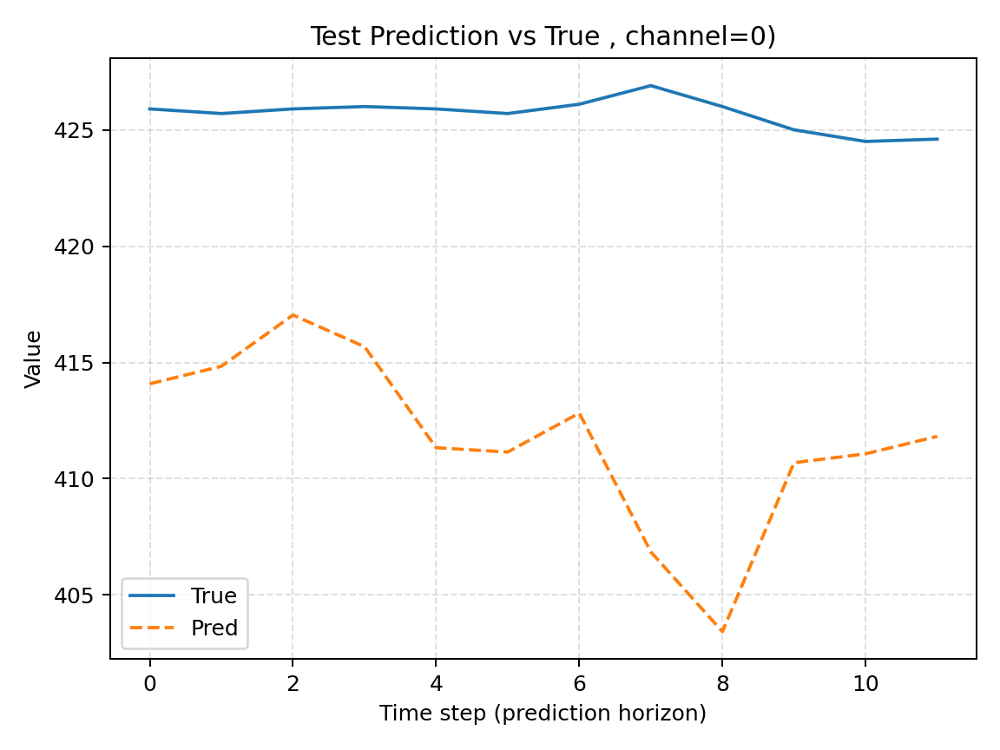

# Weather Data Prediction using Informer

## Overview
This project utilizes the Informer model to predict weather data. Unlike traditional time series forecasting models, which often rely on strict assumptions, the Informer model leverages encoding and decoding mechanisms to improve prediction accuracy. The model is designed to handle long-range dependencies efficiently, making it ideal for forecasting complex weather data.

## Data
The dataset used for this project is a publicly available weather dataset, located in `~\Informer2020-main\data\customer`. It contains historical weather data, which is processed and used for training and prediction.

## Features
- **Time Series Prediction**: Uses Informer for accurate weather prediction based on past data.
- **Efficient Modeling**: Utilizes Informer's attention mechanism to model long-term dependencies in the data.
- **Forecasting**: Predicts weather conditions based on historical data, useful for tasks like weather forecasting and climate trend analysis.

## Installation
Install the necessary dependencies by using the following:

```bash
pip install -r requirements.txt

##prediction



